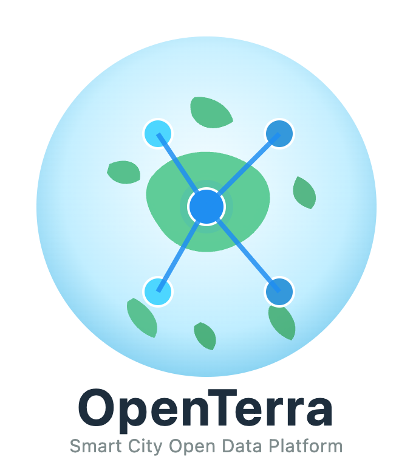

# Open-Terra

<p align="center">
    
</p>

Open-Terra is an open-source IoT and smart city data platform built with FIWARE-compliant components. It provides an extensible architecture for collecting, processing, and managing real-time sensor data from smart city infrastructures.

## Skills & Badges
<p align="center">
    
</p>

<p align="center">
    <a href="https://choosealicense.com/licenses/mit/">
        
    </a>
    <a href="https://www.fiware.org/">
        
    </a>
    <a href="https://github.com/dinhduongdev/Open-Terra">
        
    </a>
</p>

## Overview

Open-Terra is an open-source platform designed to address the challenges of managing large-scale IoT deployments in smart cities. It integrates multiple components to handle data ingestion from IoT devices, real-time processing, storage, and provides both backend APIs and a modern web interface for data visualization and management.

### Smart City Problems Solved

Through these integrated components, Open-Terra addresses critical smart city challenges:

- **Data Interoperability**: Standardized NGSI-LD format enables seamless integration of heterogeneous IoT devices and data sources
- **Real-time Monitoring**: Event-driven architecture with MQTT and message queuing enables immediate response to sensor events
- **Scalable Data Processing**: Distributed microservices architecture handles high-volume data streams from city-wide sensor networks
- **Traffic & Flood Management**: Purpose-built simulators for traffic flow and water level monitoring with predictive capabilities
- **Decision Support**: Centralized data platform provides analytics and insights for urban planning and emergency response
- **System Reliability**: Docker containerization and database migrations ensure consistent, maintainable deployments


## Project Structure

```
Open-Terra/
├── assets/                     # Project assets (logos, images)
├── backend/                    # FastAPI backend service
├── context-broker/             # FIWARE Context Broker infrastructure (Orion-LD, MongoDB, Mosquitto)
├── crawler/                    # Data crawler and processor service
├── dummy-iot-devices/          # IoT device simulator (traffic, water level monitoring)
├── frontend/                   # Next.js web dashboard with React components
├── LICENSE                     # MIT License
└── README.md                   # This file
```

## How It Works

### System Architecture

<p align="center">
    
</p>

### Data Flow

Open-Terra operates as a distributed system with the following data flow:

1. **Data Collection**: IoT devices transmit sensor data via MQTT using the UltraLight 2.0 protocol
2. **Processing**: The crawler application normalizes and processes incoming data
3. **Context Broker**: FIWARE Orion-LD receives and maintains contextual data in NGSI-LD format
4. **Storage**: Processed data is persisted in databases
5. **API Layer**: FastAPI backend provides REST endpoints for data access and management
6. **Presentation**: Next.js frontend provides interactive data visualization and control interface

### Component Details

**IoT Device Simulator**
- Generates realistic sensor data for traffic flow.
- Simulates water level monitoring with flood detection
- Implements rush hour patterns (6:30-9 AM, 12-1 PM, 5-7 PM)
- Calculates tidal surge predictions using lunar calendar
- Transmits data via MQTT using UltraLight 2.0 protocol
- Provides web dashboard for real-time device control and monitoring
- Located in: `/dummy-iot-devices`

**Context Broker (FIWARE Infrastructure)**
- FIWARE Orion-LD handles semantic data management in NGSI-LD format
- MongoDB stores IoT Agent configuration and device metadata
- TimescaleDB (PostgreSQL) stores temporal entity data with time-series optimizations
- FIWARE Mintaka provides temporal operations and historical data queries
- Eclipse Mosquitto MQTT broker manages message routing from IoT devices
- IoT Agent UltraLight translates device protocols to NGSI-LD entities
- Ensures data interoperability and standardization across the platform
- Located in: `/context-broker`

**Crawler Service**
- Ingests data from multiple open sources (OpenWeather, OpenAQ,...)
- Applies data normalization and validation rules
- Transforms raw sensor data into standardized formats
- Publishes processed data to configured targets
- Supports extensible protocol adapters for future integrations
- Built with FastAPI for high-performance async operations
- Located in: `/crawler`

**Backend Service**
- RESTful API for data access, user management, and system administration
- FastAPI framework providing OpenAPI/Swagger documentation
- PostgreSQL database with SQLAlchemy ORM for persistence
- Redis cache layer for improving query performance and session management
- Alembic database migration system for schema version control
- Background job processing with arq for asynchronous tasks
- Role-based access control (RBAC) for security
- Located in: `/backend`

**Frontend Application**
- Using Next.js for optimal performance and SEO
- React components for interactive user interfaces
- TypeScript for type-safe code and better development experience
- i18n internationalization supporting English and Vietnamese
- Real-time data visualization and monitoring dashboards
- Responsive design for mobile and desktop platforms
- Located in: `/frontend`

## Standards and Compliance

Open-Terra adheres to the following standards and practices:

- **FIWARE NGSI-LD**: Semantic data model standardization
- **Smart Data Models**: FIWARE-aligned data models for IoT devices
- **REST API**: Standard HTTP methods and status codes
- **OpenAPI**: API documentation and schema definitions
- **Docker**: Containerized deployment and environment consistency
- **Python**: PEP 8 code style
- **TypeScript**: Strict type checking for frontend code
- **Git**: Semantic versioning and branch-based workflows

## Contributing

We welcome contributions from the community. To contribute:

1. Fork the repository
2. Create a feature branch: `git checkout -b feature/your-feature`
3. Make your changes and commit: `git commit -am 'Add new feature'`
4. Push to the branch: `git push origin feature/your-feature`
5. Submit a pull request

Please ensure:
- Code follows project style guidelines (checked with ruff for Python, ESLint for JavaScript)
- All tests pass
- New features include tests
- Documentation is updated

## Documentation

For detailed information please refer to the corresponding README files within each directory or visit the [GitHub Wiki](https://github.com/dinhduongdev/Open-Terra/wiki).

## License

This project is licensed under the MIT License. See the [LICENSE](LICENSE) file for details.

## Authors

Developed by Vibe Coders / HCMCOU

## Support

For issues, questions, or suggestions:
- Check the Wiki for existing solutions
- Open an issue on GitHub
- Review the documentation

## Acknowledgments

Open-Terra is built upon the shoulders of exceptional open-source projects and initiatives:

- **FIWARE**: For providing the comprehensive NGSI-LD context broker and IoT agent standards that enable semantic interoperability
- **Smart Data Models**: For standardized data models aligned with FIWARE best practices
- **TimescaleDB**: For time-series database optimizations that power temporal data analytics
- **Docker & Kubernetes**: For containerization standards that enable consistent deployments
- **PostgreSQL & MongoDB**: For robust database technologies supporting our data layer
- **Eclipse Mosquitto**: For reliable MQTT broker implementation
- **FastAPI**: For high-performance async web framework capabilities
- **Next.js & React**: For modern frontend development frameworks and best practices


We extend our gratitude to all contributors and the open-source community whose work makes projects like this possible.