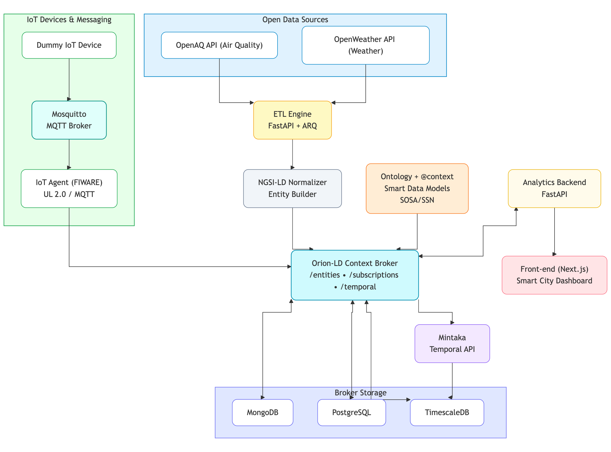

# Dummy IoT Devices

The Dummy IoT Devices component provides realistic IoT device simulation for Open-Terra's smart city platform. It generates sensor data for traffic flow and water level monitoring, transmitting via MQTT using the UltraLight 2.0 protocol in compliance with FIWARE Smart Data Models.

## Skills & Badges

<p align="center">
    
</p>

<p align="center">
    <a href="https://choosealicense.com/licenses/mit/">
        
    </a>
    <a href="https://www.fiware.org/">
        
    </a>
    <a href="https://github.com/dinhduongdev/Open-Terra">
        
    </a>
</p>

## Overview

This component simulates multiple IoT devices deployed across Ho Chi Minh City, Vietnam, monitoring traffic conditions and water levels at various locations. The simulator provides realistic data patterns including rush hour traffic simulation and tidal surge predictions based on lunar calendar calculations.

## Architecture

The simulator is built with Node.js using an object-oriented architecture:

### Core Components

**Device Classes** (`devices/`)
- `BaseDevice.js`: Abstract base class defining device interface and common functionality
- `trafficFlowObserved.js`: Traffic monitoring device with rush hour simulation (6:30-9 AM, 12-1 PM, 5-7 PM)
- `waterObserved.js`: Water level monitoring with flood detection and tidal calculations

**Utilities** (`utils/`)
- `mqttClient.js`: MQTT connection manager for broker communication
- `ultralightEncoder.js`: UltraLight 2.0 protocol message encoding
- `lunarCalendar.js`: Lunar calendar calculations for tidal surge prediction

**Configuration** (`config.js`)
- Multi-device configuration
- Sensor location definitions (latitude, longitude)
- Device IDs and entity name mappings
- Data transmission intervals
- MQTT and IoT Agent connection settings

**Provisioning** (`provisioning.js`)
- Automatic device registration with IoT Agent
- Service and service-path configuration
- Attribute mapping definitions
- Entity type association

**Web Interface** (`server.js`, `public/`)
- Express.js server for device control dashboard
- Real-time data visualization
- Individual device start/stop controls
- Adjustable transmission intervals
- Accessible on port 3030

### Data Flow



## Device Types

### Traffic Flow Monitoring

Simulates vehicle traffic sensors with:
- Vehicle count tracking
- Average speed calculation
- Congestion level detection
- Lane occupancy percentage
- Rush hour pattern simulation:
  - Morning: 6:30-9:00 AM
  - Lunch: 12:00-1:00 PM
  - Evening: 5:00-7:00 PM

Data model: [TrafficFlowObserved](https://github.com/smart-data-models/dataModel.Transportation)

### Water Level Monitoring

Simulates flood monitoring sensors with:
- Water level measurement (meters)
- Flow rate monitoring (cubic meters/second)
- Flood status classification (normal, warning, danger)
- Tidal surge prediction using lunar calendar
- Seasonal variation modeling

Data model: [WaterObserved](https://github.com/smart-data-models/dataModel.Environment)

## Key Features

- **Realistic Simulation**: Time-based patterns for traffic and tidal cycles
- **FIWARE Compliance**: Smart Data Models and UltraLight 2.0 protocol
- **Auto-Provisioning**: Automatic device registration with IoT Agent
- **Web Dashboard**: Real-time monitoring and control interface
- **Multi-Device Support**: Configurable number of sensors per type
- **Docker Deployment**: Containerized for easy deployment
- **Extensible**: Plugin architecture for new device types

## Technology Stack

- **Node.js**: JavaScript runtime for device simulation
- **Express.js**: Web server for control dashboard
- **MQTT.js**: MQTT client library

## Usage

### Headless CLI Mode

The simulator provides a comprehensive command-line interface for headless operation:

#### Provision Devices

Register devices with the IoT Agent before first use:

```bash
# Provision all devices
npm run provision

# Provision only traffic devices
node cli.js provision traffic

# Provision only water devices
node cli.js provision water
```

#### Start Devices

```bash
# Start all devices (default)
npm start

# Start only traffic devices
node cli.js start --traffic

# Start only water devices
node cli.js start --water

# Start a specific device
node cli.js start --device=traffic001
```

#### List Devices

```bash
# List all configured devices
npm run list

# List only traffic devices
node cli.js list traffic

# List only water devices
node cli.js list water
```

#### Check Status

```bash
# Show system status and connectivity
npm run status
```

#### View Configuration

```bash
# Display current configuration
node cli.js config
```

#### Help

```bash
# Show all available commands
node cli.js help
```

### Web UI Mode

For interactive control with a web dashboard:

```bash
npm run ui
```

Access the dashboard at `http://localhost:3030`

### Device Configuration

Edit `config.js` to customize:
- Geographic coordinates (latitude, longitude)
- Device identifiers and entity names
- Measurement ranges and thresholds
- Update intervals per device type

## UltraLight 2.0 Protocol

Message format example:
```
t|25.5|h|65|p|1013.25
```

Where:
- `t`: temperature attribute
- `25.5`: value
- `h`: humidity attribute
- `65`: value
- Attributes separated by `|`

The protocol provides:
- Compact message size for constrained networks
- Simple key-value pair encoding
- Efficient bandwidth usage
- Easy parsing and validation

## Web Dashboard

Features:
- Device status indicators (online/offline)
- Real-time sensor readings
- Start/stop controls per device
- Interval adjustment sliders
- Connection status monitoring
- Log viewer for MQTT messages

Access at: `http://localhost:3030`

## Docker Deployment

The simulator runs in a containerized environment:

**Container Specification**
- Base image: Node.js Alpine
- Exposed port: 3030 (web UI)
- Network: `open-terra-network`
- Automatic restart policy
- Volume mounts for configuration

## Integration Points

This component integrates with Open-Terra services:

- **context-broker**: Sends sensor data via IoT Agent and Mosquitto
- **backend**: Entities queryable through backend API
- **frontend**: Data visualized in dashboard and maps
- **crawler**: Complements external data sources

## Simulation Algorithms

**Traffic Rush Hours**
- Multiplier applied during peak times
- Gradual increase/decrease for realistic transitions
- Randomization for natural variance
- Speed inversely correlated with congestion

**Tidal Calculations**
- Lunar phase calculations
- Tidal coefficient based on moon position
- Seasonal adjustments
- Storm surge modeling (future enhancement)

## Architecture Considerations

**Scalability**
- Configurable device count
- Adjustable transmission frequencies
- Resource-efficient implementation
- Horizontal scaling via multiple containers

**Extensibility**
- Plugin-based device architecture
- Easy addition of new sensor types
- Configurable data models
- Custom simulation algorithms

**Reliability**
- Automatic MQTT reconnection
- Health check endpoints
- Error logging and recovery
- Graceful shutdown handling

## Documentation

For detailed setup, configuration, and usage instructions, refer to the [Open-Terra Wiki](https://github.com/dinhduongdev/Open-Terra/wiki).

## Standards Compliance

- FIWARE Smart Data Models
- UltraLight 2.0 Protocol
- NGSI-LD entity format
- MQTT 3.1.1
- Docker best practices

## License

This component is part of the Open-Terra project, licensed under the MIT License.
